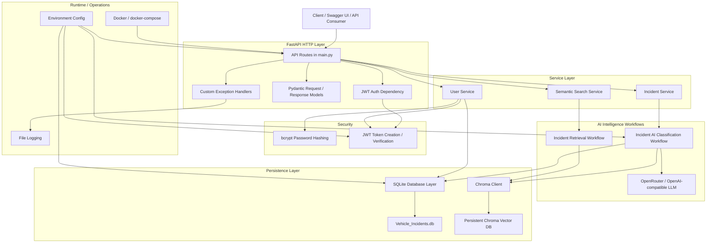
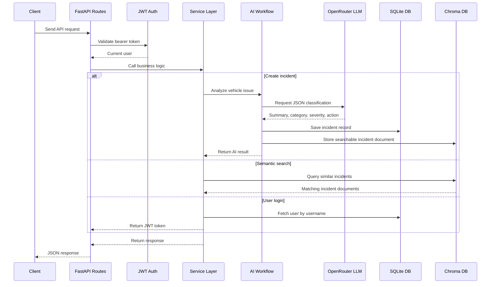

# Vehicle AI Platform Architecture

## Request Flow

## Main Components

- `main.py`: FastAPI application, route registration, authentication dependency usage.
- `Models/`: Pydantic API contracts for incidents and users.
- `Services/`: Business logic for incidents, users, login, and semantic search.
- `AIIntelligenceWorkflows/`: LLM-based incident classification and Chroma retrieval logic.
- `DatabaseLayer/`: SQLite persistence for incidents and users.
- `VectorDB/`: Chroma persistent vector database integration.
- `AuthHandler/`: Password hashing and JWT token handling.
- `ExceptionHandlers/`: API-level exception mapping and structured error responses.
- `Core/Logging.py`: Application file logging.
- `Dockerfile` and `docker-compose.yml`: Containerized runtime setup.
